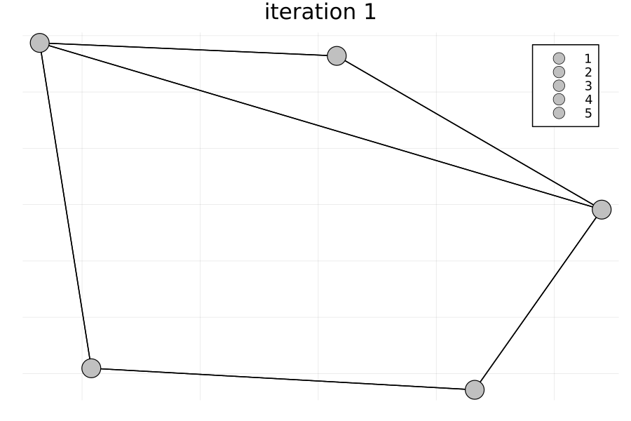

# On dimensionality of feature vectors in MPNNs
Official Julia implementation of the paper: "On dimensionality of feature vectors in MPNNs".

## Getting Started

### Setup 
1.  Download the repo:
```bash
---
```
2. Install Julia
- For Windows
     
```bash
winget install julia -s msstore
```

- For Linux and MacOS

```bash
curl -fsSL https://install.julialang.org | sh
```

3. Integrate Julia in Jupyter by running in Julia:

```Julia bash
using Pkg
Pkg.add("IJulia")
```

After that, open `main.ipynb`, select the Julia kernel and run the experiments.



